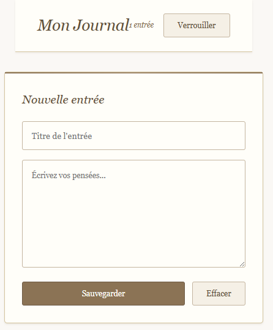

# Secure_Personal_Journal

## Description
Application web permettant d’écrire et de consulter des notes personnelles protégées par un mot de passe, avec stockage local chiffré des données.  
Ce projet est le **vingt-et-unième** du défi personnel **100 projets en 2026**.

---

## Objectifs du projet
- Implémenter une protection par mot de passe
- Chiffrer et déchiffrer des données côté client
- Gérer une session simple
- Protéger des données sensibles dans le LocalStorage
- Structurer une application plus avancée

---

## Plateforme
- Web (navigateur)

---

## Technologies utilisées
- HTML
- CSS
- JavaScript 
- LocalStorage
- Web Crypto API (ou logique de chiffrement personnalisée)

---

## Fonctionnalités
- Création d’un mot de passe principal
- Écran de verrouillage
- Ajout d’une entrée (titre + contenu)
- Liste des entrées enregistrées
- Suppression d’une entrée
- Données chiffrées dans le stockage local

---

## Design & UX
- Interface minimaliste et intime
- Écran de connexion sobre
- Zone d’écriture confortable et lisible
- Indications visuelles discrètes de sécurité
- Responsive (mobile et desktop)

---

## Captures d’écran

---

## Ce que j’ai appris
- Gestion d’un mot de passe côté client
- Bases du chiffrement en JavaScript
- Manipulation sécurisée du LocalStorage
- Structuration d’une application multi-étapes
- Amélioration de l’expérience utilisateur avec un écran verrouillé

---

## Améliorations possibles
- Modification du mot de passe
- Export sécurisé des entrées
- Auto-verrouillage après inactivité
- Recherche dans les notes
- Mode sombre

---

## Statut du projet
 **Projet terminé**
